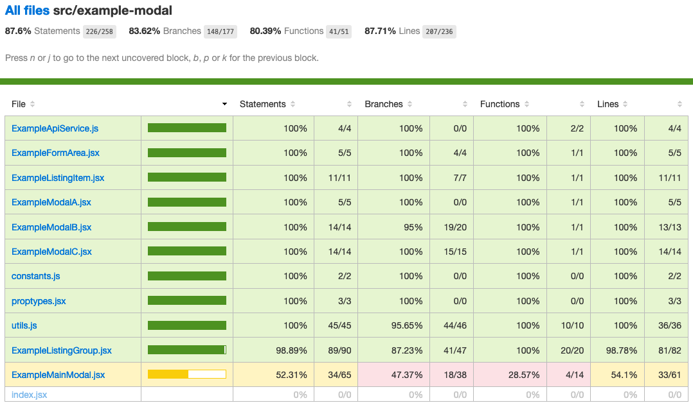

# Test Coverage

You can gather test coverage information by running the command:

```bash
jest --collectCoverage
```

By default, this will output a **Lcov** document that can be viewed online. The report is located in the `./coverage` folder. An Lcov document is basically a generated HTML document containing source code annotated with code coverage information. You can learn more about Lcov [here](https://en.wikipedia.org/wiki/Gcov#Command_line_options).

You can also create a command and place it inside your `package.json` file like so:

```javascript
{
  script: {
    "test:coverage": "jest --collectCoverage",
  }
}
```

Then via the command line, you can run:

```bash
npm run test:coverage
```

## Understanding the Report

After the generating the document via `jest --collectCoverage`, open up `index.html` in your browser. The coverage report should be located in the `./coverage/lcov-report/` folder by default.



| Types | Definition |
| ----- | ---------- |
| Statement | Has each statement in the program been executed? |
| Branch | Has each `if/else` statements been executed? |
| Function | Has each function been called? |
| Line | Has each executable line been executed? |

---

## Reporting Options

Inside the `jest.config.js` file, you can specify additional options.

### Collect Coverage From

```javascript
// jest.config.js

{
  "collectCoverageFrom": [
    "**/*.{js,jsx}",
    "!**/node_modules/**",
    "!**/vendor/**"
  ]
}
```

This will do the following:
1. Collect coverage from all files with the `.js` and `.jsx` extensions.
2. Skip coverage from files found within the `./node_modules` and `./vendor` directories.

### Output as JSON

Rather than as an HTML document, you can also choose to output the coverage information as JSON.

```javascript
// jest.config.js
{
  "coverageReporters": ["json", "locv"]
}
```

### Location for Storing Coverage Report

Optionally, you can also specify where the report should be stored.

`--coverageDirectory='folder-to-place-coverage-report'` command.

### Specifying a Target Coverage Percentage

```javascript
// jest.config.js
{
  "coverageThreshold": {
    "global": {
      "branches": 80,
      "functions": 80,
      "lines": 80,
      "statements": -10
    }
  }
}
```

This means that the test will fail
- if branches, functions, and lines are less than 80% covered by the test suites
- if the number of statements that are uncovered exceed 10.

You can also target thresholds for specific components/files:

```javascript
// jest.config.js
{
  "coverageThreshold": {
    "global": {
      "branches": 50,
      "functions": 50,
      "lines": 50,
      "statements": 50
    },
    "./src/hooks/**/*.js": {
      "statements": 90
    },
    "./src/api/very-important-module.js": {
      "branches": 100,
      "functions": 100,
      "lines": 100,
      "statements": 100
    }
  }
}
```

The test will fail if all branches, functions, lines, and statements are not 100% covered for the `/src/api/very-important-module.js` file.

---

## Optional: Pre-Commit Hook

[**Husky**](https://github.com/typicode/husky): a library to help improve your commits

This can be very useful because you can do a pre-commit hook to make sure that the new code you add pass the expected coverage percentage that you set before it can be commited.

```bash
npm install husky --save-dev
```

```
// package.json
{
  "husky": {
    "hooks": {
      "pre-commit": "npm run lint && npm test"
    }
  }
}
```

---

**Sources:**

- https://jestjs.io/docs/cli#--coverageboolean
- https://dev.to/stevescruz/awesome-jest-tip-coverage-report-h5j
- https://www.emgoto.com/jest-code-coverage/
- https://en.wikipedia.org/wiki/Code_coverage